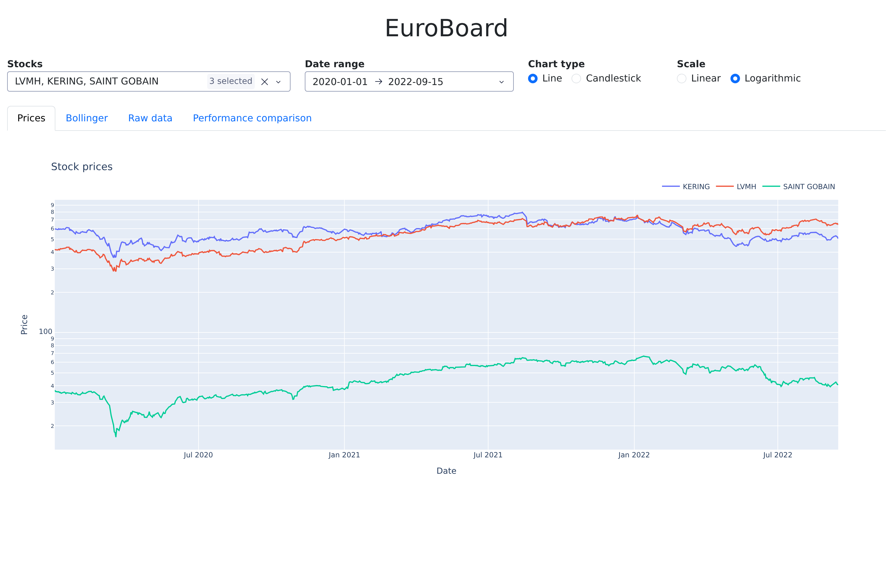
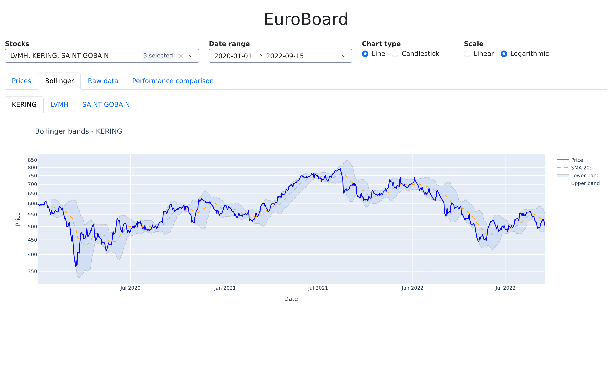
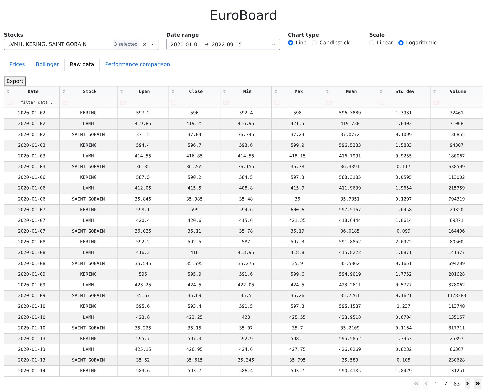
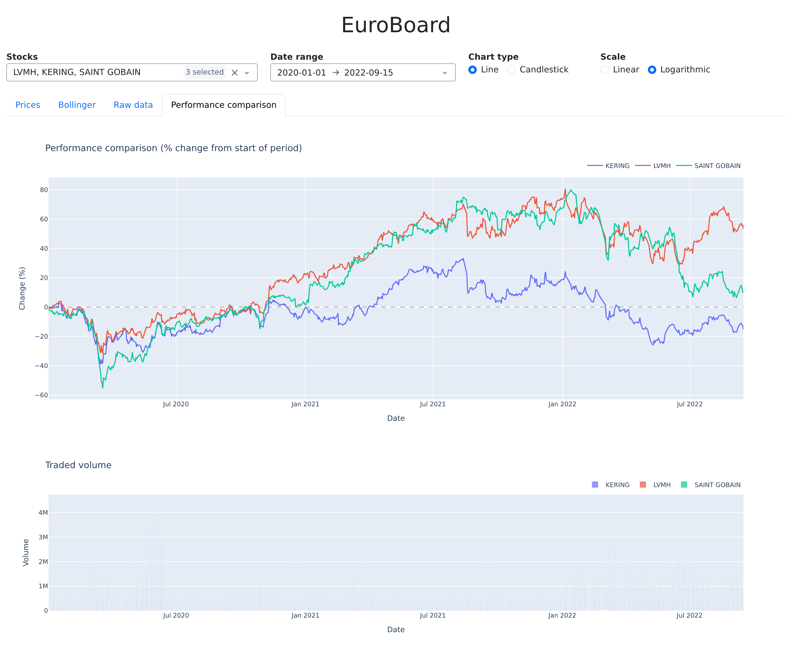

# EuroBoard

Interactive dashboard for European stock market data, backed by a TimescaleDB
hypertable store and an ETL pipeline that ingests raw exchange data files.

Two years of Paris, Amsterdam, Brussels and Milan equities — roughly 12 million
intraday points across 1 300+ companies — queried interactively from the browser.


## Features

- **ETL pipeline**: ingests Boursorama intraday snapshots (bz2 pickles, one
  directory per year) and Euronext end-of-day exports (CSV/XLSX), resolves
  companies and markets, and writes to TimescaleDB in batches. Progress is
  recorded per Euronext file and per Boursorama day, so an interrupted import
  resumes where it stopped instead of starting over.
- **Price charts**: line or candlestick, on a linear or logarithmic scale.
- **Bollinger bands**: 20-period simple moving average with a ±2σ envelope.
- **Raw data table**: daily open, close, min, max, mean, standard deviation and
  volume; sortable, filterable, exportable to CSV.
- **Performance comparison**: several stocks normalised to percent change from
  the start of the selected period, with a traded-volume chart alongside.

## Architecture

```
data/*.bz2, *.csv, *.xlsx          raw exchange files, mounted read-only
         │
         ▼
    bourse/etl.py                  parse ─ resolve companies ─ batch COPY
         │                         progress tracked in file_done
         ▼
    TimescaleDB                    stocks / daystocks hypertables
         │                         indexed on (cid, date DESC)
         ▼
    bourse/app.py                  Dash callbacks, one renderer per tab
         │
         ▼
    localhost:8050
```

Two Compose services: `database` (TimescaleDB on PostgreSQL 17, data in a named
volume) and `dashboard` (the Dash application, which runs the import on startup
and then serves). The dashboard waits for the database to pass its health check
before starting.

`stocks` holds every intraday point; `daystocks` holds the daily OHLC aggregates
computed from them with a pandas `groupby`. Both are hypertables partitioned on
`date`, which is what keeps the range queries behind each tab responsive.

## Getting the data

The dataset is not in this repository — it is several gigabytes of raw exchange
files. Download both archives and unpack them into `./data`, which is mounted
into the container at `/mnt/data`:

```bash
mkdir -p data && cd data
curl -O https://www.lrde.epita.fr/~ricou/pybd/projet/bourso.tgz
curl -O https://www.lrde.epita.fr/~ricou/pybd/projet/euronext.tgz
tar xzf bourso.tgz && tar xzf euronext.tgz
```

The result should look like this:

```
data/
├── bourso/            # Boursorama intraday snapshots
│   ├── 2020/          #   one directory per year
│   │   └── compA 2020-01-02 09:05:02.123456.bz2
│   └── 2021/
└── euronext/          # Euronext end-of-day exports
    ├── Euronext_Equities_2020-05-04.csv
    └── Euronext_Equities_2022-10-20.xlsx
```

Without it the application still starts, but the stock selector comes up empty.

## Running it

```bash
docker compose up --build
```

The dashboard is served at <http://localhost:8050>.

On startup the application imports the configured date ranges, then serves. The
first run takes a few minutes; later runs skip what is already imported. The
database lives in a named Docker volume, so it survives `docker compose down`
and machine restarts — use `docker compose down -v` to start from an empty one.

### Configuration

| Variable | Default | Purpose |
|---|---|---|
| `EURONEXT_START` / `EURONEXT_END` | `2020-05-01` / `2022-09-16` | Euronext range to import |
| `BOURSO_START` / `BOURSO_END` | `2020-01-01` / `2022-01-01` | Boursorama range to import |
| `DASH_DEBUG` | `0` | `1` enables Dash debug mode and hot reload |

End dates are exclusive.

### Local development

`compose.override.yml` is picked up automatically by Docker Compose. It mounts
`./bourse` into the container and enables Dash debug mode, so the application
reloads on save without rebuilding the image.

## Layout

```
bourse/
├── app.py                 # Dash application: layout, callbacks, tab renderers
├── etl.py                 # extract, transform and load pipeline
└── timescaledb_model.py   # schema definition and database access layer
compose.yml                # database + dashboard services
compose.override.yml       # local development overrides
Dockerfile                 # uv-based build
```

## Screenshots

**Prices** — line or candlestick, linear or logarithmic.



**Bollinger bands** — 20-period moving average with a ±2σ envelope.



**Raw data** — sortable, filterable, exportable to CSV.



**Performance comparison** — normalised to percent change, with traded volume.


