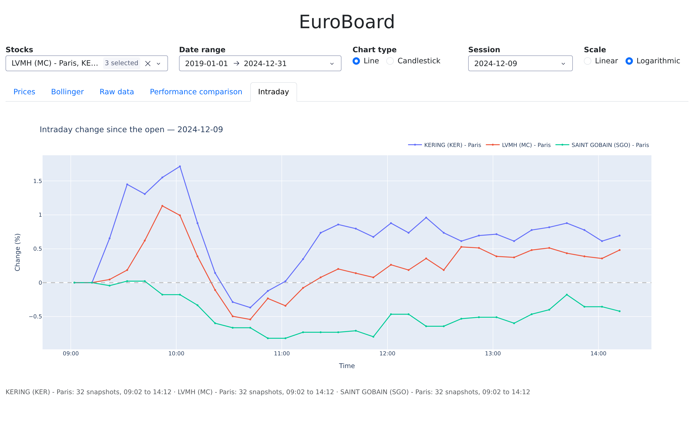

# EuroBoard

Interactive dashboard for European stock market data, backed by a TimescaleDB
hypertable store and an ETL pipeline that ingests raw exchange data files.

Six years of Paris, Amsterdam, Brussels and Milan equities — up to 52 million
intraday quotes over 1 606 listings, of which the 1 216 that actually trade are
offered for exploration — queried interactively from the browser, down to the
ten-minute snapshot.


## Features

- **ETL pipeline**: ingests Boursorama intraday snapshots (bz2 pickles, one
  directory per year) and Euronext end-of-day exports (CSV/XLSX), resolves
  companies and markets, and writes to TimescaleDB in batches. Progress is
  recorded per Euronext file and per Boursorama day, so an interrupted import
  resumes where it stopped instead of starting over.
- **Price charts**: line or candlestick, on a linear or logarithmic scale.
- **Bollinger bands**: 20-period simple moving average with a ±2σ envelope.
- **Raw data table**: daily open, close, min, max, mean, standard deviation and
  volume; sortable, filterable, exportable to CSV.
- **Performance comparison**: several stocks normalised to percent change from
  the start of the selected period, with a traded-volume chart alongside.
- **Intraday**: the price path of a single session, snapshot by snapshot, which
  is what the daily aggregates flatten into one OHLC row. Several listings are
  compared on their move since the open, since a stock quoted at 85 and one at
  650 share no readable axis over moves of a fraction of a percent.
- **Dormant listings filtered out**: an exchange keeps quoting a line after it
  stops trading, repeating its last close. Those quotes are stored but not
  offered — a listing has to have traded on at least a tenth of the days it was
  quoted, and only days with an actual trade are plotted. Without this a line
  that has not changed hands in years still draws a confident flat trend.

## Architecture

```
data/*.bz2, *.csv, *.xlsx          raw exchange files, mounted read-only
         │
         ▼
    bourse/etl.py                  parse ─ resolve companies ─ batch COPY
         │                         progress tracked in file_done
         ▼
    TimescaleDB                    stocks / daystocks hypertables
         │                         indexed on (cid, date DESC)
         ▼
    bourse/app.py                  Dash callbacks, one renderer per tab
         │
         ▼
    localhost:8050
```

Two Compose services: `database` (TimescaleDB on PostgreSQL 17, data in a named
volume) and `dashboard` (the Dash application, which runs the import on startup
and then serves). The dashboard waits for the database to pass its health check
before starting.

`stocks` holds every intraday point; `daystocks` holds the daily OHLC aggregates
computed from them with a pandas `groupby`. Both are hypertables partitioned on
`date`, which is what keeps the range queries behind each tab responsive.

## What the archive actually looks like

Most of the work in this project went into reading the source files correctly.
They are a six-year scrape of a retail broker's quote pages, and the format
drifts across that span without any version marker.

| | |
|---|---|
| Boursorama snapshots | bz2-compressed pickles until 2023, raw pickles from 2024, with the `.bz2` suffix dropped from the filename |
| Pickle protocol | changes on 2023-08-02, mid-archive: the newer files store a block placement the current pandas refuses |
| Decimal separator | a dot, except on 42 sessions of 2024 where it is a comma |
| Thousands separator | a space: `1 157.500` |
| Quote values | carry a status: `58.010(c)` is a close, `315.000(s)` a suspended line |
| Euronext exports | CSV until 2022-09, XLSX after |

None of these announce themselves. Read naively, the extension check alone
skipped 15 054 files, the pickle change cost 98 sessions, and the status markers
turned roughly 40% of every snapshot into missing values -- all of it silently,
because a parser that returns nothing looks exactly like a day the market was
closed. The import now reports unreadable sessions rather than swallowing them.

The two sources also disagree about what a company is. Boursorama prefixes its
symbols with a market code and carries no ISIN, Euronext uses the bare symbol
and does: nothing matched, so a company present in both was created twice and
its history split down the middle -- 248 names were duplicated that way. A
cross-listed stock reads "Euronext Paris, Amsterdam, Brussels", and filing it
under the first market found rather than the first market named put Saint-Gobain
on the Amsterdam book, where it had not traded in six years.

What survives is not all worth showing either. An exchange keeps quoting a line
long after it stops trading, repeating its last close, and 349 of the 1 606
listings never trade at all over the whole archive. Those quotes are stored but
not offered: a flat line reads as a trend, a moving average of a constant is
that constant, and Bollinger bands around it have zero width.

## Getting the data

The dataset is not in this repository — it is several gigabytes of raw exchange
files. Download both archives and unpack them into `./data`, which is mounted
into the container at `/mnt/data`:

```bash
mkdir -p data && cd data
curl -O https://www.lrde.epita.fr/~ricou/pybd/projet/bourso.tgz
curl -O https://www.lrde.epita.fr/~ricou/pybd/projet/euronext.tgz
tar xzf bourso.tgz && tar xzf euronext.tgz
```

The result should look like this:

```
data/
├── bourso/            # Boursorama intraday snapshots, 2019-2024
│   ├── 2019/          #   one directory per year
│   │   └── compA 2019-01-02 09:05:02.123456.bz2
│   └── ...
└── euronext/          # Euronext end-of-day exports, 2020-2024
    ├── Euronext_Equities_2020-05-04.csv    # CSV until 2022-09
    └── Euronext_Equities_2022-10-20.xlsx   # XLSX from 2022-10
```

Without it the application still starts, but the stock selector comes up empty.

## Running it

```bash
docker compose up --build
```

The dashboard is served at <http://localhost:8050>.

On startup the application imports the configured date ranges, then serves. The
default range is a two-year slice, which takes about fifteen minutes to load;
widening it to the whole archive takes closer to an hour and yields some 48
million intraday quotes. Later runs skip what is already imported, per Euronext
file and per Boursorama day, so an interrupted import resumes rather than starts
over. The database lives in a named Docker volume, so it survives
`docker compose down` and machine restarts — use `docker compose down -v` to
start from an empty one.

To load everything the archive has:

```bash
BOURSO_START=2019-01-01 BOURSO_END=2025-01-01 EURONEXT_END=2025-01-01 \
  docker compose up -d
```

### Configuration

| Variable | Default | Purpose |
|---|---|---|
| `EURONEXT_START` / `EURONEXT_END` | `2020-05-01` / `2022-09-16` | Euronext range to import |
| `BOURSO_START` / `BOURSO_END` | `2020-01-01` / `2022-01-01` | Boursorama range to import |
| `DASH_DEBUG` | `0` | `1` enables Dash debug mode and hot reload |

End dates are exclusive.

### Local development

`compose.override.yml` is picked up automatically by Docker Compose. It mounts
`./bourse` into the container and enables Dash debug mode, so the application
reloads on save without rebuilding the image.

## Tests

```bash
uv run --group dev pytest
```

The suite covers the parts that read the archive -- container format, decimal
separator, status markers, symbol prefixes, market attribution. Every case
stands for a variation the source actually contains, several of which cost real
data before they were found.

## Layout

```
bourse/
├── app.py                 # Dash application: layout, callbacks, tab renderers
├── etl.py                 # extract, transform and load pipeline
└── timescaledb_model.py   # schema definition and database access layer
compose.yml                # database + dashboard services
compose.override.yml       # local development overrides
Dockerfile                 # uv-based build
tests/                     # parsing and resolution
tools/screenshots.py       # regenerates docs/images
```

`bourse/timescaledb_model.py` is the schema and access layer given with the
assignment and is left as it was; everything else is this project.

## Screenshots

Regenerate them from a running dashboard with `tools/screenshots.py`.

**Prices** — line or candlestick, linear or logarithmic.


**Bollinger bands** — 20-period moving average with a ±2σ envelope.


**Raw data** — sortable, filterable, exportable to CSV.


**Performance comparison** — normalised to percent change, with traded volume.


**Intraday** — one session, snapshot by snapshot.


